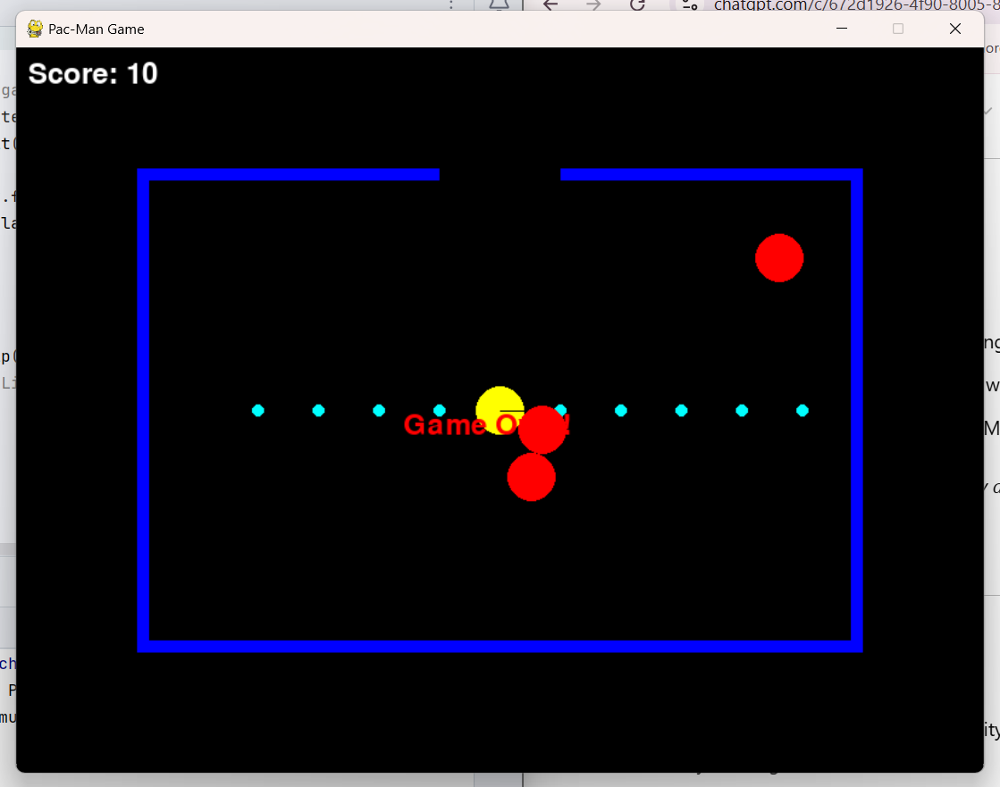

# Pac-Man Game 🎮

## Table of Contents
- [Project Overview](#project-overview)
- [Features](#features)
- [Installation Instructions](#installation-instructions)
- [Usage Guide](#usage-guide)
- [Screenshots](#screenshots--gifs)
- [Contributing to the Project](#contributing-to-the-project)
- [Maintainers and Contributors](#maintainers-and-contributors)
- [Getting Help](#getting-help)

---

## Project Overview

**Pac-Man Game** is a Python-based rendition of the classic arcade game. Built using the `pygame` library, this project allows users to control Pac-Man, navigate through a maze, collect dots, and avoid ghosts. The goal is to eat all the dots without getting caught by the ghosts. This project demonstrates basic game development principles, including player movement, collision detection, and score tracking.

### Project Goals
- **Create an engaging gameplay experience**: A modern take on Pac-Man, complete with visuals, sound, and scoring.
- **Implement interactive gameplay**: Through keyboard controls, allowing players to move Pac-Man around the maze.
- **Showcase programming fundamentals**: Use Python's game development capabilities via the `pygame` library.

---

## Features
- **Player Control**: Move Pac-Man around the game screen using arrow keys.
- **Chomping Effect**: Dynamic mouth opening and closing animation for Pac-Man.
- **Randomized Ghost Movement**: Ghosts move around the maze and bounce off walls, adding challenge to gameplay.
- **Maze Walls and Dot Collecting**: Navigate with in walls to collect dots and avoid ghosts.
- **Score Tracking**: Real-time score display based on dots collected.
- **Winning and Losing Conditions**: Win the game by collecting all dots, or lose if a ghost catches Pac-Man.
- **Confetti Animation for Win Condition**: Enjoy a colorful confetti effect when all dots are collected and you win the game.

---

## Installation Instructions

To set up the **Pac-Man Game** on your computer, follow these steps:

1. **Clone or Download the Repository**:
   ```bash
   git clone https://github.com/victorrndungu/Pacman1.1
2. Install Required Packages: Make sure you have Python 3 and pip installed. Then, install pygame:
    ```bash
    pip install pygame
3.Run the Game: Launch the game by running the Python script:
    ```bash    
    python pacman_game.py

## Usage Guide

Once the game is running, use the following keys and controls:

1. Arrow Keys: Control Pac-Man’s movement to navigate the maze.
2. Objective: Eat all the dots scattered around the screen while avoiding ghosts.
3. Winning the Game: Collect all dots to trigger the "You Win!" message with a confetti effect.
4. Losing the Game: Collide with any ghost to trigger the "Game Over" message.
Note: The game will automatically exit after a short delay once you win or lose. Restart the game to play again!

Example Usage
To start:

Move Pac-Man to collect dots.
Watch for ghosts! Avoid them to keep playing.
Try to beat your score or complete the level by collecting all dots.

## Screenshots 
1. Main Gameplay: Showing Pac-Man moving around, eating dots.


2. Win Condition: Confetti animation upon winning the game.


3. Game Over Screen: Displayed when Pac-Man collides with a ghost.


## Contributing to the Project
We welcome contributions from the community to make this game even better! Here’s how you can get started:

1. Fork the Repository: Click on the "Fork" button at the top right of the repository page.
Clone Your Forked Repository
2. Clone Your Forked Repository:
    ```bash 
   git clone https://github.com/victorrndungu/Pacman1.1
3. Create a Branch: Use a descriptive name for your branch.
    ```bash
    git checkout -b feature-or-bug-fix-name
4. Make Changes: Update code, fix bugs, or add new features.
5. Push to GitHub
    ```bash
git add .
git commit -m "Describe your changes"
git push origin feature-or-bug-fix-name
6. Submit a Pull Request: Go to your fork on GitHub and submit a PR. Please include a detailed description of the changes.

## Maintainers and Contributors
Project Maintainer: Consolata (https://github.com/Con5lata)

Contributors:
Conslata Nanzala(https://github.com/Con5lata)
Victor Kahindo (https://github.com/victorrndungu)
Ryan Kyalo (https://github.com/Mbindyo-Ryan)
Maximillian Mwenda (https://github.com/maximillian15)
Melissa Ndeti (https://github.com/melissandeti22)


## Getting Help
or questions, suggestions, or troubleshooting, you can:

Check the project’s GitHub Issues page: GitHub Issues.
Ask in the Discussions section on GitHub for help from other users and developers.

Thank you for trying out our Pac-Man Game! We hope you enjoy playing it and feel free to reach out if you have any questions or feedback!